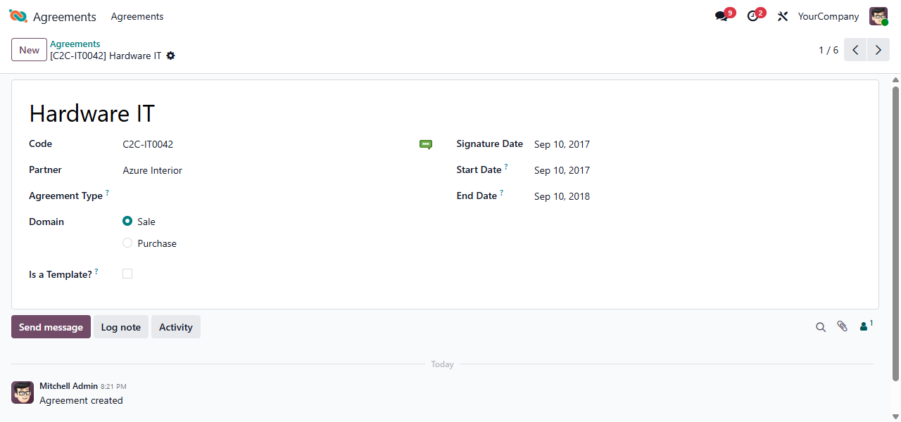

This module adds an *Agreement* object with the following properties:

- code,
- name,
- link to a partner,
- signature date.
- start date.
- end date.

Optionally, you can also enable using: \* agreement types \* a flag to
set an agreement as a template agreement

