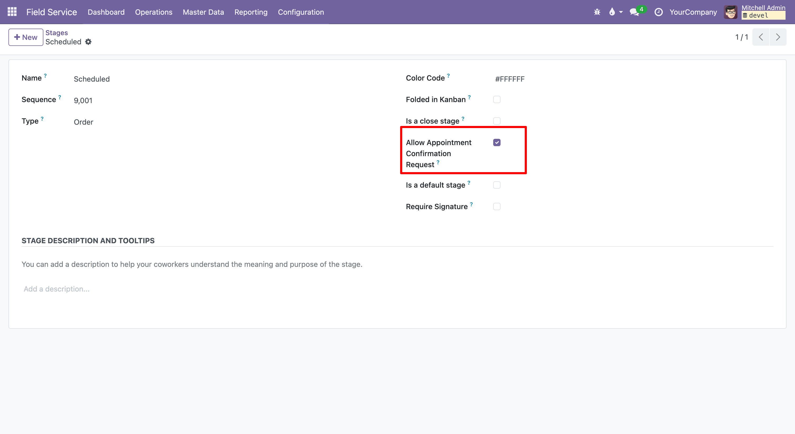
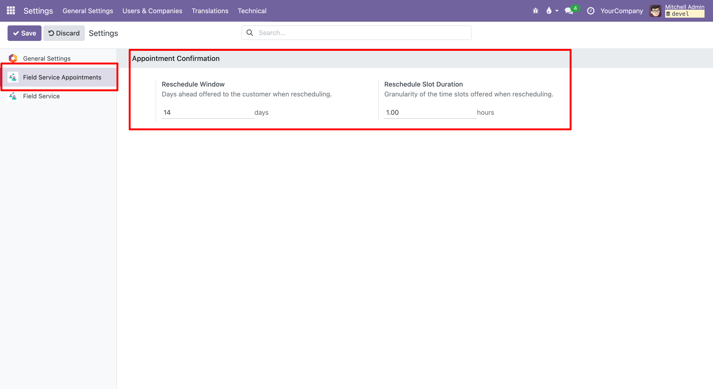

To configure this module you need to:

1. Go to *Field Service > Configuration > Stages* and tick **Allow Appointment
   Confirmation Request** on the stages where the confirmation button should be
   available.
2. Optionally adjust, under *Settings > Field Service Appointments*:
   * **Reschedule Window** – how many days ahead the customer is offered
     available slots when rescheduling (default 14). A larger value lets the
     customer book further into the future.
   * **Reschedule Slot Duration** – the granularity, in hours, of the slots
     offered to the customer; for example 1 hour produces 08:00, 09:00, 10:00…
     while 2 hours produces 08:00, 10:00, 12:00… (default 1).
3. The request, confirmation and reschedule emails can be edited without
   touching code in *Settings > Technical > Email Templates*
   (`FSM Appointment: ...`).

The customer email is taken from the partner linked to the order location, so
make sure that partner has a valid email address.

For rescheduling to offer time slots, the assigned worker must have a working
schedule (*Working Hours* / `resource.calendar`); the company working schedule
is used as a fallback.

