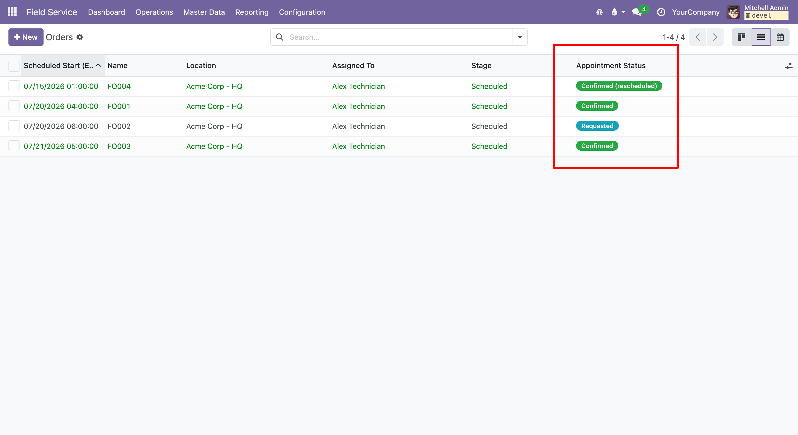
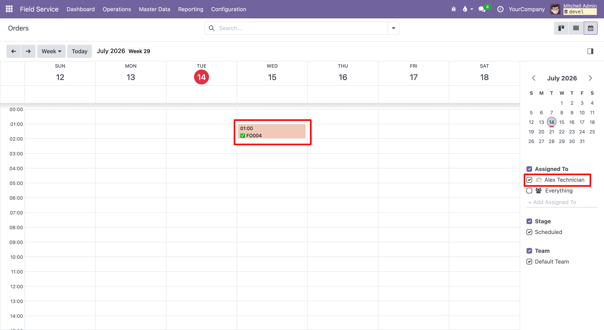

This module automates the confirmation of field service appointments with
the final customer.

From a field service order the coordinator can request a confirmation from
the customer through a pre-filled, editable email (standard mail composer).
The customer confirms or reschedules the visit from a secure tokenized link,
without any login or portal user, and the order is updated accordingly:

* the appointment status is tracked (Pending, Requested, Confirmed) with a
  badge, a ribbon and calendar/list decorations; a confirmed appointment that
  was rescheduled is shown as "Confirmed (rescheduled)";
* confirming and rescheduling are logged in the chatter and notify the order
  followers and the assigned worker; the customer also receives a confirmation
  email;
* picking an available slot when rescheduling is treated as the customer's
  acceptance, so the appointment is automatically confirmed on the new date;
* on confirmation (or reschedule) the customer can download an RFC 5545 `.ics`
  file to add the visit to Google Calendar, Outlook or Apple Calendar;
* rescheduling only offers slots where the assigned worker is actually
  available, based on their working schedule and existing orders;
* an appointment whose date has already passed can no longer be confirmed
  online, only rescheduled to a future slot.

The module is designed as a generic OCA contribution and only depends on
`fieldservice`, `mail`, `resource` and `portal`.

The appointment status is shown as a coloured badge in the list view and as a
coloured event (prefixed with a check mark once confirmed) in the calendar:

