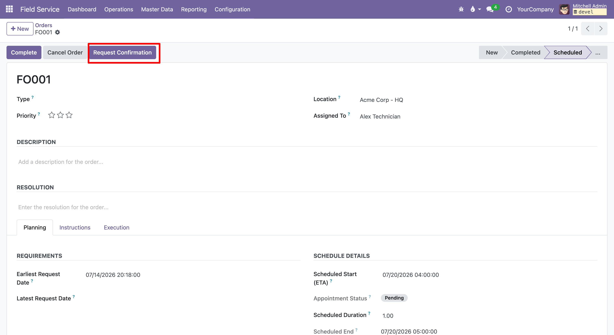
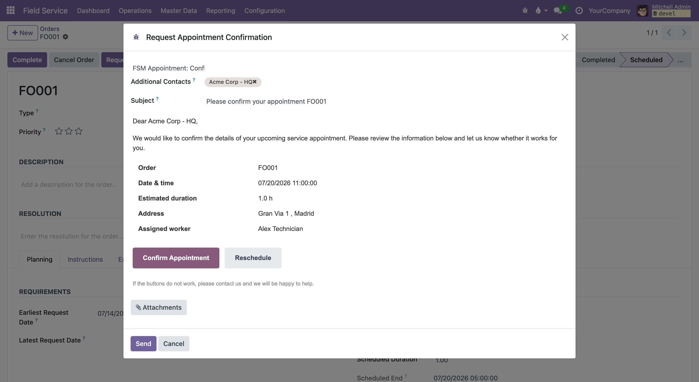
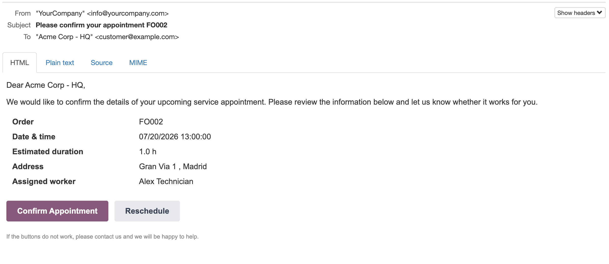
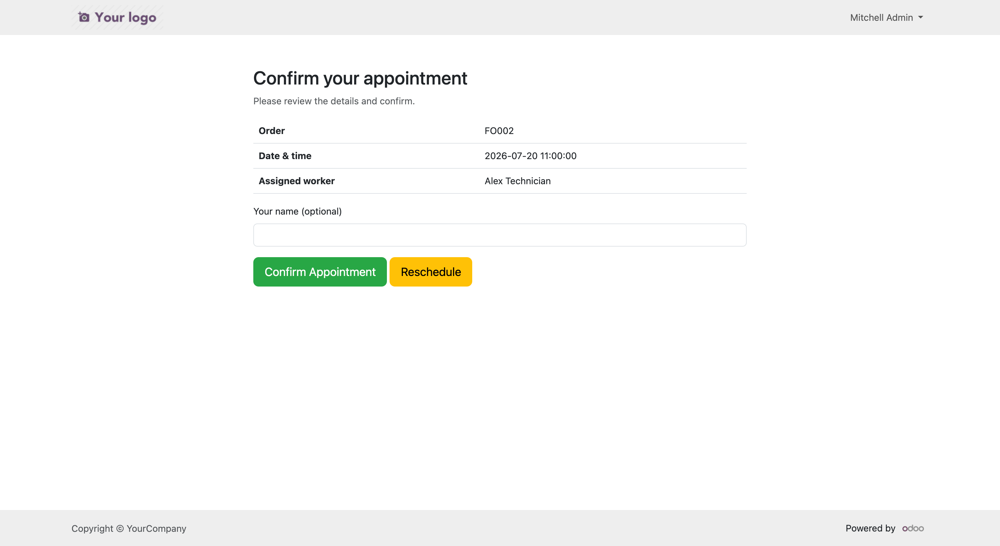
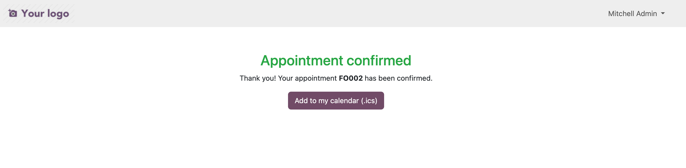
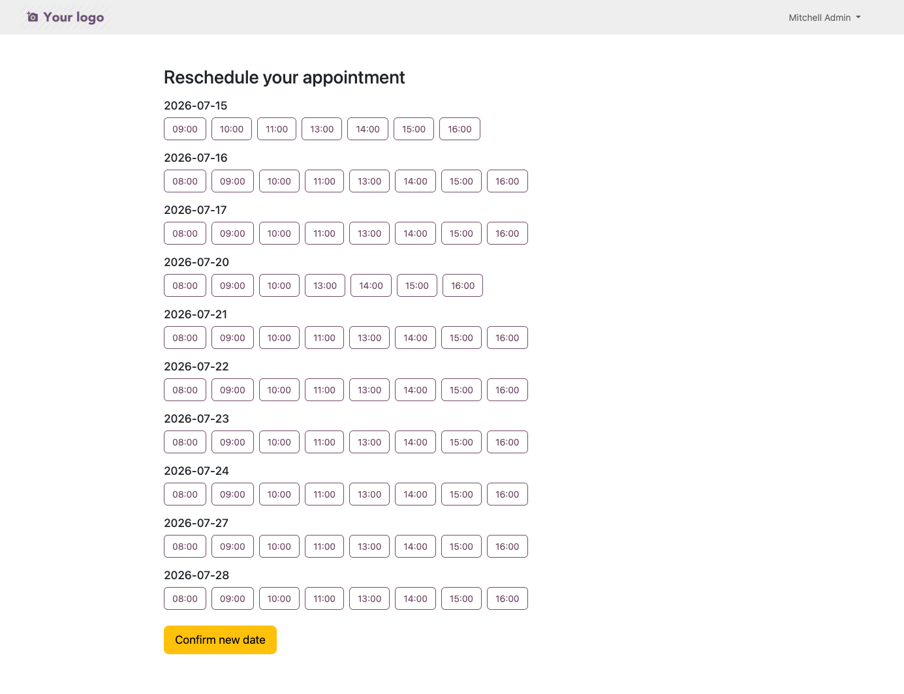
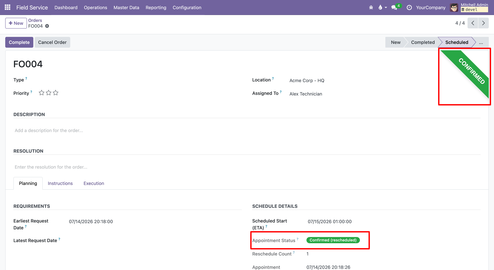
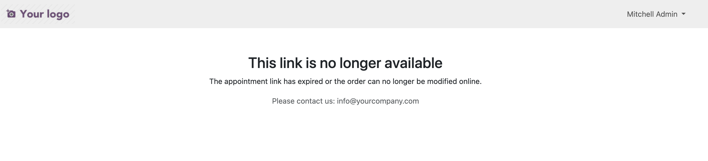
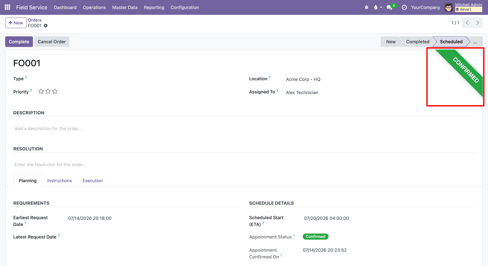
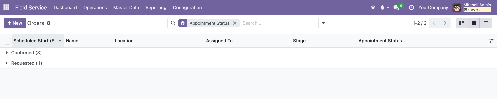

The **Request Confirmation** button only appears on a field service order that
has an assigned worker, a scheduled date, a customer email, and is in a stage
where **Allow Appointment Confirmation Request** is ticked (see *Configuration*):

1. Press **Request Confirmation**. A mail composer opens with the pre-filled
   request template; edit it if needed and send it. The appointment status
   becomes *Requested* and the customer receives the email.

   

   

   

2. From the email (secure link, no login) the customer can:

   - **Confirm Appointment**: the status becomes *Confirmed*, a note is logged,
     the followers and the assigned worker are notified and the customer is
     offered an `.ics` download.

     

     

   - **Reschedule**: the customer picks an available slot of the assigned
     worker; the order date is updated and the appointment is **automatically
     confirmed** on the new date (shown as *Confirmed (rescheduled)*). The
     customer receives a confirmation email and can download the `.ics`.

     

     

3. If the appointment date has already passed, the confirmation link redirects
   the customer to the reschedule page to pick a new future slot. An invalid or
   expired token shows a friendly page instead:

   

Confirmed appointments are highlighted on the order form with a ribbon, and can
be filtered or grouped by appointment status from the list view:

