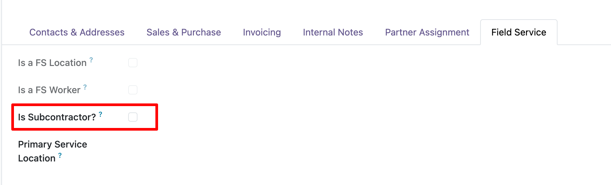
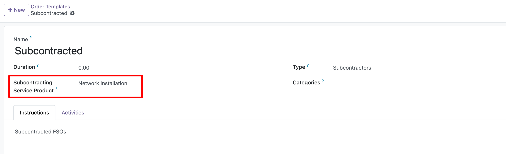
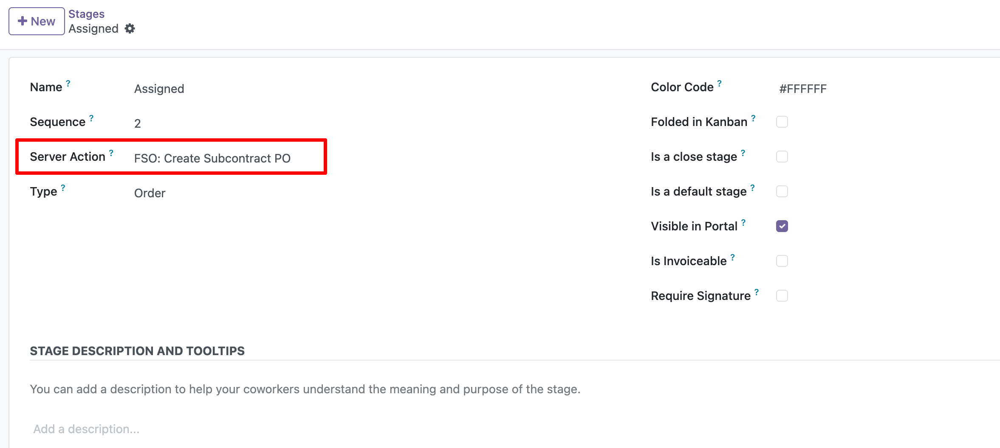

## Subcontractor partner setup

1. Go to Contacts.
2. Open the partner linked to the Field Service worker, or the parent company
   of that partner.
3. Configure as a vendor the partner that should receive the subcontract
   Purchase Order.
4. Enable Is Subcontractor? on the relevant partner.
5. The subcontract vendor is resolved with the following priority:
   - If the worker partner has a parent company and that parent company is
     marked as Is Subcontractor?, the Purchase Order is created for the parent
     company.
   - If the previous rule does not apply and the worker partner is marked as
     Is Subcontractor?, the Purchase Order is created directly for the worker
     partner, such as an individual freelancer.
   - If neither rule applies, no Purchase Order is created because the worker
     is considered internal.
6. Configure vendor prices on the subcontracting service product for the
   partner that will receive the Purchase Order.

## Template setup

1. Go to Field Service > Master Data > Templates.
2. Open the template that can create subcontract Purchase Orders.
3. Set the Subcontracting Service Product.
4. Use a service product that is purchased based on received quantities.
5. Configure a vendor price on the product for each resolved subcontractor
   partner that can receive a Purchase Order.
6. If vendor bills are controlled by received quantities, update the delivered
   quantity before creating the vendor bill.

## Stage automation

1. Go to Field Service > Configuration > Stages.
2. Open the stage that should create the draft Purchase Order.
3. Assign the server action FSO: Create Subcontract PO.

1. Open the closing stage that should update delivered quantities.
2. Assign the server action FSO: Update Subcontract PO Delivered Qty.
3. This action copies timesheet hours to the Purchase Order delivered quantity.

